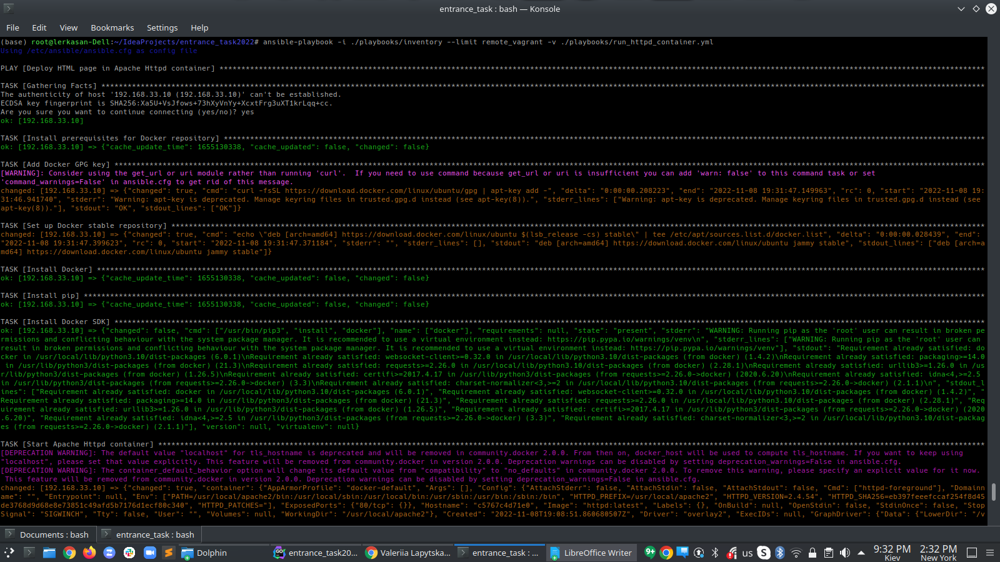
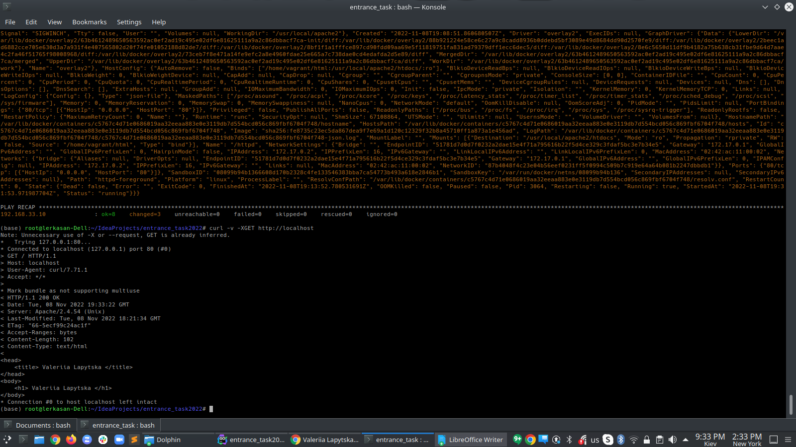
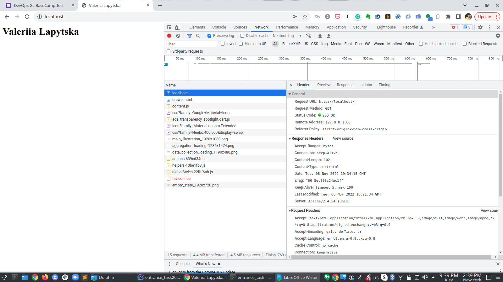
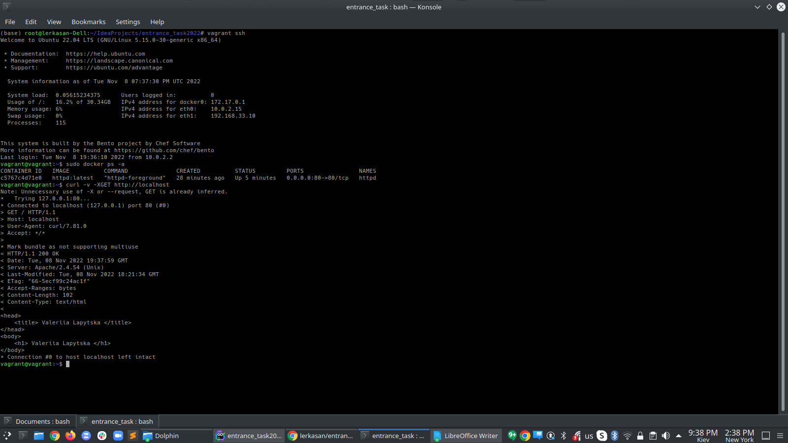

Technologies used in this project:
 - Bash
 - Vagrant
 - Ansible
 - Docker

This project features:
 - automation of a virtual machine creation (using Vagrant)
 - automation of Apache Httpd installation and  deployment of a static HTML page via bash script 
 - automation of a virtual machine configuration, e.g. installation of Docker  (using Ansible)
 - deployment of a static HTML page using Apache Httpd docker container

**Prerequisites:**
 - VirtualBox (installation script **./scripts/install_virtualbox_vagrant.sh** is provided for Ubuntu)
 - Vagrant (installation script **./scripts/install_virtualbox_vagrant.sh** is provided for Ubuntu)

**HowTo**

1. Run **./scripts/install_virtualbox_vagrant.sh**
2. Open **bash** folder: `cd bash`   
3. Run **vagrant up**
_Note: Bash script will be run locally on a virtual machine during its provisioning_
Apache2 service will be available on the Vagrant virtual machine on port 80 at URL http://localhost and on host machine on port 8080 at URL http://localhost:8080  

_____Alternatively:_____

1. Run **./scripts/install_virtualbox_vagrant.sh**
2. Open **ansible_docker** folder: `cd ansible_docker` 
3. Run **vagrant up**
_Note: Ansible playbooks will be run locally on a virtual machine during its provisioning_
Apache2 service will be available on the Vagrant virtual machine on port 80 at URL http://localhost and on host machine on port 8080 at URL http://localhost:8080
Apache2 container will be available on the Vagrant virtual machine on port 8080 at URL http://localhost:8080 and on host machine on port 8081 at URL http://localhost:8081
**Results:**

_Host machine_

_Virtual machine_

